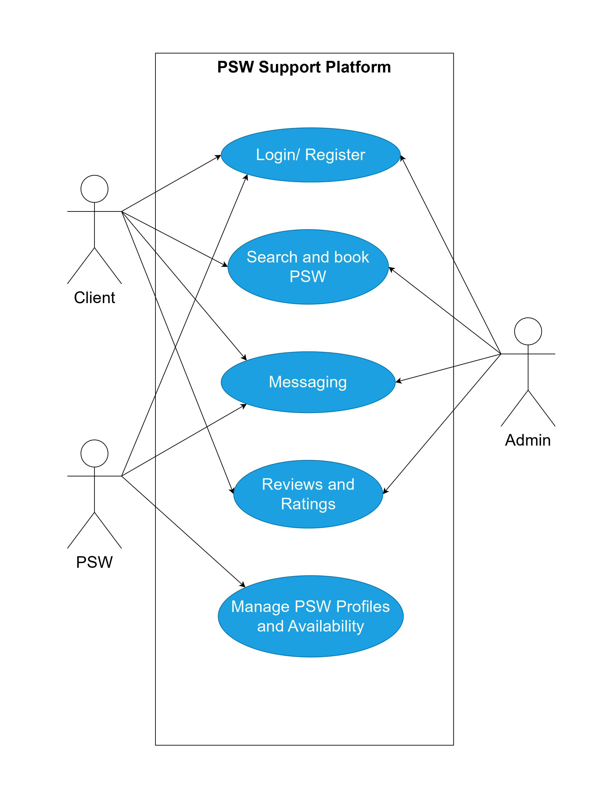
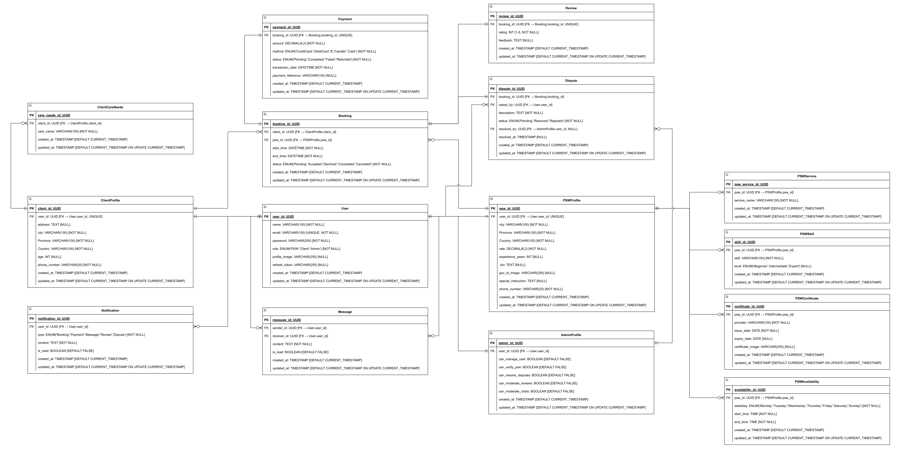

# Requirements Gathering & Documentation

This document captures the requirements for the **PSW Support Platform**, including functional and non-functional requirements, user roles, and an initial draft of the system design (use cases & ERD).

---

## 1. Functional Requirements

The platform must provide the following key features:

1. **User Registration & Authentication**

   - Users (PSWs, Clients, Admins) can register and log in securely.
   - Authentication with email & password (future option: social login, 2FA).
   - Password recovery via email.

2. **Profile Management**

   - **PSW Profiles:** Skills, experience, certifications, hourly rate, availability.
   - **Client Profiles:** Basic info, location, care needs, preferences.
   - Profile picture & document upload (resume, certifications, ID verification).

3. **Booking System**

   - Clients can search PSWs based on location, availability, and expertise.
   - Clients can book services for a chosen time slot.
   - PSWs can accept or decline bookings.

4. **Reviews & Ratings**

   - Clients can leave reviews and star ratings for PSWs.
   - Average ratings displayed on PSW profile.

5. **Payment Integration (Future Phase)**

   - Clients can pay securely within the platform.
   - Payment history available for both PSWs and Clients.

6. **Admin Management**
   - Manage users (PSWs, Clients).
   - Approve/verify PSW profiles.
   - Handle disputes & flagged content.

---

## 2. Non-Functional Requirements

- **Security**

  - Encrypted password storage (bcrypt).
  - Role-based access control.

- **Performance**

  - The system should handle **at least 500 concurrent users**.
  - Booking & messaging responses must be under **2 seconds**.

- **Usability**

  - Simple, accessible UI following **WCAG 2.1 accessibility standards**.

- **Reliability & Availability**

  - Backup & recovery system in place.

- **Maintainability**
  - Well-documented APIs.

---

## 3. User Roles

1. **Client**

   - Register, create a profile, search for PSWs.
   - Book appointments and pay.
   - Communicate with PSWs via chat.

2. **PSW (Personal Support Worker)**

   - Set availability & hourly rate.
   - Accept/decline client bookings.
   - Chat with clients.

3. **Admin**
   - Manage users and verify PSW profiles.
   - Moderate reviews & chats if flagged.

---

## 4. Use Case Diagram / User Stories

### User Stories

- As a **Client**, I want to search for PSWs by location and availability so that I can find the right support quickly.
- As a **Client**, I want to book a PSW so that I can schedule support services.
- As a **PSW**, I want to manage my availability so that clients can only book me when I’m free.
- As an **Admin**, I want to verify PSWs so that only trusted professionals are listed.
- As an **Admin**, I want to view reports so that I can monitor platform activity.

---

## 5. Database Design (ERD Draft)

### Entities:

- **User**  
  (user_id, name, email, password, role, profile_image, refresh_token, created_at, updated_at)

- **PSWProfile**  
  (psw_id, user_id, city, province, country, rate, experience_years, bio, gov_id_image, special_instruction, phone_number, created_at, updated_at)

- **PSWService**  
  (psw_service_id, psw_id, service_name, created_at, updated_at)

- **PSWSkill**  
  (skill_id, psw_id, skill, level, created_at, updated_at)

- **PSWCertificate**  
  (certificate_id, psw_id, provider, issue_date, expiry_date, certificate_image, created_at, updated_at)

- **PSWAvailability**  
  (availability_id, psw_id, weekday, start_time, end_time, created_at, updated_at)

- **ClientProfile**  
  (client_id, user_id, address, city, province, country, age, phone_number, created_at, updated_at)

- **ClientCareNeeds**  
  (care_needs_id, client_id, care_name, created_at, updated_at)

- **Booking**  
  (booking_id, client_id, psw_id, start_time, end_time, status, created_at, updated_at)

- **Payment**  
  (payment_id, booking_id, amount, method, status, transaction_date, payment_reference, created_at, updated_at)

- **Message**  
  (message_id, sender_id, receiver_id, content, is_read, created_at, updated_at)

- **Notification**  
  (notification_id, user_id, type, content, is_read, created_at, updated_at)

- **Review**  
  (review_id, booking_id, client_id, psw_id, rating, feedback, created_at, updated_at)

- **AdminProfile**  
  (admin_id, user_id, can_manage_user, can_verify_psw, can_resolve_disputes, can_moderate_reviews, can_moderate_chats, created_at, updated_at)

- **Dispute**  
  (dispute_id, booking_id, raised_by, description, status, resolved_by, resolved_at, created_at, updated_at)

### Relationships:

#### User ↔ PSWProfile

- **One-to-One**  
  Each **User** (role = PSW) has **one PSWProfile**.  
  `User.user_id → PSWProfile.user_id`

#### User ↔ ClientProfile

- **One-to-One**  
  Each **User** (role = Client) has **one ClientProfile**.  
  `User.user_id → ClientProfile.user_id`

#### User ↔ AdminProfile

- **One-to-One**  
  Each **User** (role = Admin) has **one AdminProfile**.  
  `User.user_id → AdminProfile.user_id`

#### PSWProfile ↔ PSWService

- **One-to-Many**  
  Each **PSWProfile** can offer **multiple services**.  
  `PSWProfile.psw_id → PSWService.psw_id`

#### PSWProfile ↔ PSWSkill

- **One-to-Many**  
  Each **PSWProfile** can have **multiple skills**.  
  `PSWProfile.psw_id → PSWSkill.psw_id`

#### PSWProfile ↔ PSWCertificate

- **One-to-Many**  
  Each **PSWProfile** can have **multiple certificates**.  
  `PSWProfile.psw_id → PSWCertificate.psw_id`

#### PSWProfile ↔ PSWAvailability

- **One-to-Many**  
  Each **PSWProfile** can define **multiple availability slots**.  
  `PSWProfile.psw_id → PSWAvailability.psw_id`

#### ClientProfile ↔ ClientCareNeeds

- **One-to-Many**  
  Each **ClientProfile** can have **multiple care needs**.  
  `ClientProfile.client_id → ClientCareNeeds.client_id`

#### ClientProfile ↔ Booking

- **One-to-Many**  
  Each **ClientProfile** can make **multiple bookings**.  
  `ClientProfile.client_id → Booking.client_id`

#### PSWProfile ↔ Booking

- **One-to-Many**  
  Each **PSWProfile** can be assigned to **multiple bookings**.  
  `PSWProfile.psw_id → Booking.psw_id`

#### Booking ↔ Payment

- **One-to-One**  
  Each **Booking** has **one Payment record**.  
  `Booking.booking_id → Payment.booking_id`

#### Booking ↔ Review

- **One-to-One**  
  Each **Booking** can have **one Review**.  
  `Booking.booking_id → Review.booking_id`

#### Booking ↔ Dispute

- **One-to-One**  
  Each **Booking** can have **one Dispute** (if raised).  
  `Booking.booking_id → Dispute.booking_id`

#### Message (User ↔ User)

- **Many-to-Many** (implemented via One-to-Many from sender & receiver)  
  A **User** can send messages to many users and receive from many users.  
  `Message.sender_id → User.user_id`  
  `Message.receiver_id → User.user_id`

#### Notification ↔ User

- **One-to-Many**  
  Each **User** can receive **multiple notifications**.  
  `Notification.user_id → User.user_id`

#### Dispute ↔ User

- **Many-to-One**  
  A **Dispute** is raised by **one User**.  
  `Dispute.raised_by → User.user_id`

#### Dispute ↔ AdminProfile

- **Many-to-One**  
  A **Dispute** is resolved by **one Admin**.  
  `Dispute.resolved_by → AdminProfile.admin_id`

### Diagram:

---
